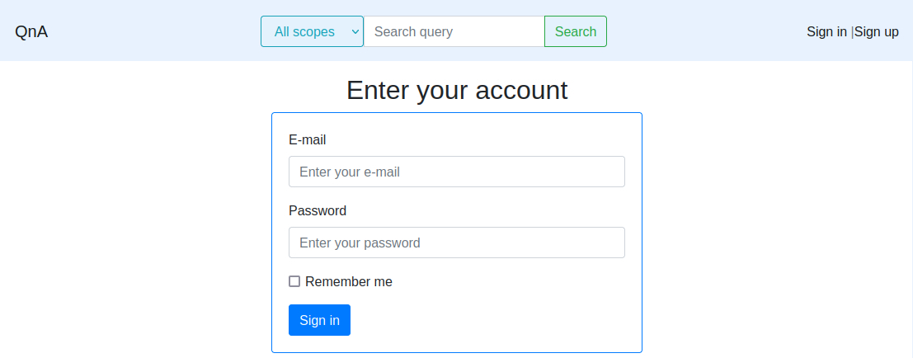

qna
======

[](https://github.com/georgiybykov/qna/actions)
[](https://github.com/georgiybykov/qna/actions)

Ruby on Rails questions and answers resource.

---

**The project includes and consists of:**

- Ruby 2.7.2
- Ruby on Rails 6.1.4
- RSpec as framework for tests
- Sidekiq with Redis for background jobs
- Elasticsearch for full-text search
- ActionCable for real-time connection using WebSockets
- OAuth 2.0 with Authorization Code Flow
- cancancan for authorization (abilities)
- RESTful API with Doorkeeper as OAuth 2.0 provider
- Production web-server is Unicorn (configuration files are in the project tree)
- Capistrano for deployment

---

#### Fetch and start the project:

```bash
$ git clone git@github.com:georgiybykov/qna.git
$ cd qna

# Install dependencies:
$ bundle install

$ cp .env.sample .env
$ cp database.yml.sample database.yml
$ cp elasticsearch.yml.sample elasticsearch.yml

$ bundle exec bin/rails db:create
$ bundle exec bin/rails db:migrate

# If you need test or development data:
$ bundle exec bin/rails db:seed
```

#### Run tests:
```bash
$ bundle exec rspec
```

#### Run linter:
```bash
$ bundle exec rubocop
```

---

### **Examples:**

- Sign in page:



- Main page:


- New question page:


___

##### Good luck! May the force be with you!